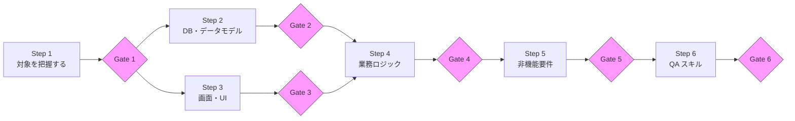

# レガシーコードから仕様を抽出する手順

このガイドは「何を・どの順番で把握すればいいか」を示します。
各 Step の終わりに Gate チェックリストで「次に進んでいいか」を確認してください。

---

## 前提: DD スキルの準備

このガイドでは **DD（Design Document）** を単位として作業を進めます。DD は「何をやるか・やったか」を記録するチケットです。

- **DD とは**: 作業タスクをチェックリスト形式で定義したドキュメント。Claude への指示と作業記録を兼ねる
- **dd-know-how**: DD を作成・管理するスキル。未導入の場合は https://github.com/ishimori/dd-know-how を参照してセットアップしてください
- **DD の作り方**: `sample_prompts/` のプロンプトをコピーして Claude に貼り付けると DD が作成される

> **Gate の宣言も DD で**: 各 Gate の通過（「Gate 1 を通過した」という人間の意思決定）も DD として明示的に起票することを推奨します。作業の痕跡が残り、後から判断を追跡できます。詳細は `sample_prompts/` の各 Gate 宣言プロンプトを参照してください。

---

## 全体の流れ



Step 2〜3 は並行して進められます。Gate で情報が揃っているか確認してから次に進んでください。

> **注**: このガイドの Gate 1〜6 は `gates/` フォルダのチェックリストに対応します。`manuals/` 内にも各ステップに Gate がありますが、番号体系が異なります（マニュアルは独自の5ステップ構成）。

---

## Step 1: 対象を把握する

まず「何があるか」の全体像を掴みます。コードを深く読む前の段階です。

> **最初にやること**: プロジェクトの `CLAUDE.md`（または `doc/document_map.md`）に
> 仕様書ファイルを登録する場所を決めておく。
> 以降の Step で仕様書を作るたびに必ずここに追記する。
> **AI はこの索引を通じてファイルの存在を知る。索引にないファイルは AI にとって「見えない」。**

### やること

**コードベースの定量把握**
- ディレクトリ構造を確認する（フォルダの役割を把握する）
- 技術スタックを確認する（言語・フレームワーク・主要ライブラリ）
- LOC（行数）とファイル数を確認する

```bash
# 技術スタックの確認例
find . -name "package.json" -o -name "requirements.txt" -o -name "pom.xml" | head -20
find . -name "*.py" | wc -l   # Pythonファイル数
```

**既存ドキュメントの棚卸し**
- README、設計書、仕様書、コメントを確認する
- 「信頼できるドキュメント」と「古くて怪しいドキュメント」を分ける
- 実際のコードと食い違っているドキュメントを見つけた場合はメモしておく

### ポイント

- この段階では深く読まない。「何があるか」だけ把握する
- 既存ドキュメントが充実していても、コードと照合するまで信頼しない
- 「思ったより大きい / 小さい」という感覚を掴む

> **DA 批判レビュー推奨**: Step 1 完了後、「本当に全体像が把握できているか？見落としているサブシステムや外部連携はないか？」を批判的に問い直す。見落としがあると後続 Step に歪みが生じる。

**DD 起票**: [sample_prompts/01_initial_survey.md](sample_prompts/01_initial_survey.md) のプロンプトを使って DD を作成してください。

**→ [Gate 1: 初回調査チェックリスト](gates/01_initial_survey.md)**

---

## Step 2: DB・データモデルを取得する

データ構造はシステムの骨格です。業務ロジックを読む前に把握しておくと理解が速くなります。

### やること

**スキーマの取得**

優先順位：ERD・設計書 > マイグレーションファイル > DDL > コードのモデル定義

```bash
# マイグレーションファイルの確認例
ls migrations/ alembic/versions/ db/migrate/
# モデル定義の確認例（Django/SQLAlchemy）
grep -r "class.*Model" src/ --include="*.py" -l
```

**主要テーブルの整理**

| テーブル名 | 用途 | 備考 |
|-----------|------|------|
| （例）users | ユーザー管理 | ロール情報あり |
| （例）orders | 注文データ | 論理削除あり |

**マスタデータの把握**

コードではわからないことがある。できれば本番 DB のマスタデータダンプ（個人情報除外）を入手する。

> **教訓**: マスタデータの具体値が不明なまま実装を進めると、識別子の不一致（日本語 vs 英語コード等）が後から横断バグとして現れる。詳細は [references/lessons_learned.md](references/lessons_learned.md) の「うまくいかなかった点 #2」を参照。

### ポイント

- ストアドプロシージャ・ビューも忘れずに確認する
- 論理削除カラム（`deleted_at`、`is_deleted` 等）は業務ロジックに影響する
- テーブル数が多い場合はコアテーブル（最も参照される）から優先する
- **DB 仕様書を作成したら `CLAUDE.md` または `document_map.md` に追記する**（例: `| テーブル一覧 | doc/spec/db/schema.md |`）

> **DA 批判レビュー推奨**: Step 2 完了後、「本当に主要テーブルを網羅しているか？マスタデータの具体値は把握できているか？」を批判的に問い直す。マスタデータの不明が後で横断バグを引き起こす。

**DD 起票**: [sample_prompts/02_database.md](sample_prompts/02_database.md) のプロンプトを使って DD を作成してください。

**→ [Gate 2: DB情報取得チェックリスト](gates/02_database.md)**

---

## Step 3: 画面・UI を把握する

どんな画面があり、何ができるかを把握します。

### やること

**画面一覧の作成**

| 画面名 | URL/パス | 主な機能 | 対象ロール |
|-------|---------|---------|-----------|
| （例）ログイン | /login | 認証 | 全員 |
| （例）ダッシュボード | /dashboard | 集計表示 | 管理者 |

**画面遷移の把握**

主要な操作フロー（申請→承認、入力→確認→完了 等）を図または文章で整理する。

**権限・ロール制御の確認**

- どのロールがどの画面を見られるか
- 同じ画面でもロールによって表示項目が変わる場合はその条件を把握する

> **教訓**: 画面仕様を抽出するとき、「画面の機能（何ができるか）」と「UIの構成（どう見せるか）」を分けて記録する。フレームワーク移行の場合、前者は忠実に移植し、後者は移行先に合わせて再設計するのが正しい。詳細は [references/lessons_learned.md](references/lessons_learned.md) の「気付き #8」を参照。

### ポイント

- submit/save 関数は UI 層でもビジネスロジックを持つことがある。必ず確認する
- モーダル・ダイアログも「画面」として一覧化する
- 画面数が多い場合はコアフロー（最もよく使われる業務フロー）から優先する
- **画面仕様書を作成したら `CLAUDE.md` または `document_map.md` に追記する**（例: `| 画面一覧 | doc/spec/screens/screen_list.md |`）

> **DA 批判レビュー推奨**: Step 3 完了後、「権限・ロールによる表示分岐を全て把握したか？UI に埋まったビジネスロジックを見落としていないか？」を批判的に問い直す。見落とした UI 層ロジックは Step 4 で拾えないことがある。

**DD 起票**: [sample_prompts/03_screens.md](sample_prompts/03_screens.md) のプロンプトを使って DD を作成してください。

**→ [Gate 3: 画面把握チェックリスト](gates/03_screens.md)**

---

## Step 4: 業務ロジックを抽出する

計算式・バリデーション・ワークフロー制御など、ビジネスルールを仕様として文書化します。

### やること

**抽出対象を絞る**

全コードを均等に読もうとしない。以下を優先する：
- コアとなる計算ロジック（料金計算、集計処理 等）
- バリデーションルール（入力制約、業務上の制約）
- 状態遷移（ワークフロー、ステータス管理）
- 外部システム連携（API 呼び出し、ファイル入出力）

**信頼度を付与する**

抽出した仕様には信頼度を付与します：

| 信頼度 | 意味 | 使い方 |
|--------|------|-------|
| `High` | コードと照合済み、根拠明確 | そのまま使える |
| `Medium` | 一部照合済み、一部推測 | 注意して使う |
| `Low` | 根拠不足、未検証 | 使う前に調査が必要 |
| `Conflicting` | コードとドキュメントで矛盾 | 解消するまで使えない |

**コードと仕様を突合する（できる場合）**

仕様書の記述とコードを照合して信頼度を上げる。Python スクリプトによる AST 解析や Grep による機械的な突合が有効。詳細は [how-to/qa-skill.md](how-to/qa-skill.md) の「コード突合の追加」を参照。

> **教訓**: 「計算ロジック」だけが業務ロジックではない。UI 層の submit/save 関数に埋まったバリデーション 12 条件が丸ごと見落とされたケースがある。詳細は [references/lessons_learned.md](references/lessons_learned.md) の「気付き #7」を参照。

### ポイント

- 仕様書は AI に書かせると AI が読みやすい構造になる（AI 自身が検索・引用できる）
- BR-001 のような採番ルールを決めておくと QA 時に参照しやすい
- 「コードに書かれていない暗黙のルール」はコードからは抽出できない。ドメインエキスパートへの確認工程を設ける
- **仕様書ファイルを作成したら即座に `CLAUDE.md` または `document_map.md` に追記する**
  - キーワードと参照先ファイルのマッピング形式が QA スキルの索引として機能する
  - 例: `| 残業、時間外 | doc/spec/business-logic/01_overtime.md |`

> **DA 批判レビュー推奨**: Step 4 完了後、「UI 層のバリデーション・submit 関数を見落としていないか？Conflicting 項目が残っていないか？信頼度 Low の項目をそのままにしていないか？」を批判的に問い直す。UI 層ロジックの見落としは実績上最も多い失敗パターン。

**DD 起票**: [sample_prompts/04_business_logic.md](sample_prompts/04_business_logic.md) のプロンプトを使って DD を作成してください。

**→ [Gate 4: 業務ロジック抽出チェックリスト](gates/04_business_logic.md)**

---

## Step 5: 非機能要件を確認する

認証・ログ・パフォーマンス・セキュリティなど、機能以外の要件を把握します。

### やること

業務ロジックを追うと非機能要件は後回しになりがちです。意識的に確認してください。

**確認カテゴリ**

- **認証・認可**: どのロールが何を操作できるか（画面レベル・データレベル）
- **ログ**: 何をログに残しているか、監査目的のログはあるか
- **パフォーマンス**: SLA・応答時間の要件はあるか、N+1 クエリなど既知の問題はあるか
- **セキュリティ**: SQLインジェクション対策、XSS対策、CSRF対策の有無
- **バックアップ・リカバリ**: どう運用されているか

> **教訓**: 個別の機能 DD を追うと非機能要件が抜ける。NFR は独立したトラックとして扱い、意識的に確認しないと漏れる。

> **DA 批判レビュー推奨**: Step 5 完了後、「認証・認可は画面レベルだけでなくデータレベルも確認したか？セキュリティ要件を「ある場合」で流していないか？」を批判的に問い直す。

**DD 起票**: [sample_prompts/05_nfr.md](sample_prompts/05_nfr.md) のプロンプトを使って DD を作成してください。

**→ [Gate 5: 非機能要件確認チェックリスト](gates/05_nfr.md)**

---

## Step 6: QA スキルを作る

仕様情報が揃ったら、「この機能の仕様は？」という質問に即答できる QA スキルを作ります。

### QA スキルとは

コードを読まずに仕様を確認できる仕組みです。仕様書のインデックスを持ち、質問をキーワードで仕様書にマッピングし、根拠付きで回答します。

作り方は [how-to/qa-skill.md](how-to/qa-skill.md) を参照してください。

> **DA 批判レビュー推奨**: Step 6 完了後、「QA スキルが答えられない質問はないか？信頼度 Low の項目が放置されていないか？仕様書の更新フローを決めずに終わっていないか？」を批判的に問い直す。

**DD 起票**: [sample_prompts/06_qa_ready.md](sample_prompts/06_qa_ready.md) のプロンプトを使って DD を作成してください。

**→ [Gate 6: QA 準備完了チェックリスト](gates/06_qa_ready.md)**

---

## 参考資料

| 資料 | 内容 |
|------|------|
| [GUIDE_IMPL.md](GUIDE_IMPL.md) | 実装のクイックリファレンス（本書の続き。仕様抽出後の構築手順） |
| [references/lessons_learned.md](references/lessons_learned.md) | 44DD 以上の実践から得た教訓 |
| [manuals/](manuals/) | 包括マニュアル（「なぜ・どうやるか」の詳細 + ゲート + アンチパターン） |
| [how-to/qa-skill.md](how-to/qa-skill.md) | QA スキルの作り方 |
