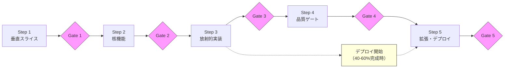

# 仕様書から新システムを構築する手順

このガイドは仕様書が完成した後、「どの順番で・何に注意して構築すればいいか」を示します。
各 Step の終わりに Gate チェックリストで「次に進んでいいか」を確認してください。

> **前提**: [GUIDE.md](GUIDE.md) の Step 1〜6（仕様抽出）が完了し、全仕様書が `[VERIFIED]` であること。

---

## 全体の流れ



デプロイは全機能完成を待たず、Step 3 中盤（40〜60%完成時）から並行して開始します。

> **注**: このガイドの Gate 1〜5 は実装フェーズ用です。[GUIDE.md](GUIDE.md) の Gate 1〜6（仕様抽出用）とは番号体系が異なります。詳細は [manuals/02_実装マニュアル.md](manuals/02_実装マニュアル.md) を参照。

---

## Step 1: 垂直スライス

全レイヤー（DB → Backend → Frontend）の技術的疎通を、**最小限の機能**で検証します。

### やること

- **DB**: マスタテーブルを一括マイグレーション（FK依存も含めて）。シードデータ投入
- **Backend**: N層構成（Router → Service → Repository）を確立。認証フローを完成
- **Frontend**: ルーティング・認証ガードを検証。API呼び出しパターンを確立
- **UI設計**: 表示密度・テーブルライブラリを確定（業務アプリでは「1画面に何行出せるか」が生産性に直結）
- **デザインガイドラインの文書化**: 下記参照

### UI設計ガイドラインの確立（重要）

垂直スライスと同時期に、**UI設計ガイドライン文書**を作成し、プロジェクトの CLAUDE.md から参照させる。
LLM（Claude Code 等）は CLAUDE.md の指示に暗黙的に従うため、ガイドラインを定義しておけば全画面で一貫したデザインが自動的に適用される。

**ガイドラインに含めるべき項目**:

| カテゴリ | 定義すべき内容 |
|---------|--------------|
| 表示密度 | フォントサイズ、行高、パディング、1画面あたりの表示行数目標 |
| カラーパレット | プライマリ/セカンダリ/エラー/警告色、コントラスト基準 |
| コンポーネント規約 | ボタンサイズ、フォーム幅、モーダルサイズ、テーブル列幅 |
| レスポンシブ方針 | 最小対応幅、ブレイクポイント |
| 編集可能テーブル | 2モード制（ナビゲーション/編集）の挙動定義（下記参照） |

**CLAUDE.md への記載例**:
```markdown
## 仕様書ルール
- `doc/spec/ui-design-guideline.md` — 画面の新規作成・デザイン変更時は必ず読み込むこと
```

> **なぜ垂直スライスで決めるか**: UI設計方針は全画面に影響する。後から変更すると全画面改修が発生する。表示密度のデフォルト設定が業務要件に合わないことが垂直スライスのPoCで判明した実例がある。

### 編集可能テーブル（Excel ライク入力表）の PoC

業務アプリでは**Excelライクな入力表**（セル編集・行追加・一括操作）がほぼ必ず必要になる。明らかに不要な場合を除き、垂直スライスの段階でPoCを実施する。

**検証すべき項目**:
- テーブルライブラリの選定（インライン編集・ソート・フィルタ対応）
- 2モード制の実装: デフォルトはナビゲーションモード（テキスト表示）、F2/ダブルクリック/文字入力で編集モードに遷移
- セルのコミットパターン: onBlur でコミット、Escape でキャンセル
- キーボード操作: Tab/Enter で次セル移動、矢印キーでセル間移動

> **教訓**: 編集可能テーブルのパターンは核機能（Step 2）以降の全入力画面の規範になる。垂直スライスで確立しておけば、以降のDDで迷うことがなくなる。

### ポイント

- 垂直スライスの目的は**アーキテクチャ検証**。最も複雑な機能ではなく、全レイヤーを通せる軽い機能を選ぶ
- マスタテーブルは全量を初回マイグレーションに含める（FK制約の芋づる式依存を回避）
- ログ基盤（構造化ログ + request_id）はこの段階で構築を強く推奨

### Gate 1

- [ ] DB マイグレーション正常動作（FK依存含む）
- [ ] Backend N層構成が動作
- [ ] 認証フロー完成（ログイン → トークン → 保護EP）
- [ ] Frontend から API 呼び出し・データ取得/更新が動作
- [ ] エラーハンドリング雛形（422/401/403/409）
- [ ] UI設計ガイドラインが文書化され、CLAUDE.md から参照されている
- [ ] 編集可能テーブルの PoC が完了している（不要な場合はスキップ理由を記録）
- [ ] DA批判レビュー実施（1件以上の問題を発見・対応）

---

## Step 2: 核機能の実装

**最も複雑な機能**を3分割パターンで構築し、実装の雛形を確立します。

### 3分割パターン

| Phase | 焦点 | ゴール |
|-------|------|--------|
| Phase 1: 動作 | 機能が動くこと | 全レイヤーでデータが流れる |
| Phase 2: 見た目 | UIが使えること | レイアウト・操作性の最適化 |
| Phase 3: 正確性 | ロジックが正しいこと | バリデーション・ビジネスルール完成 |

### Phase 0: 事前精査（全DDで必須）

各DDの実装前に以下を必ず実施する:

1. **移行元 submit/save 関数のバリデーション全量リストアップ**
2. リストと VERIFIED 仕様書の突合（仕様漏れの早期発見）
3. 状態遷移がある場合は状態遷移図を作成
4. DA批判レビュー

### ポイント

- 「一度に全部正しく作る」は失敗する。動くものを触ることで設計の再考が生まれる
- 核機能で確立した設計パターンは後続の全画面で再利用される（**複利効果**）
- 設計判断（データモデリング・計算配置・権限パターン等）は必ず文書化する

### Gate 2

- [ ] 核機能の3分割パターンが全て完了
- [ ] 全バリデーション条件がテスト付きで移植済み
- [ ] 設計判断が文書化されている
- [ ] DA批判レビュー実施（1件以上の問題を発見・対応）

---

## Step 3: 放射的実装

核機能で確立したパターンを使い、依存画面群を効率的に展開します。

### やること

- **依存グラフ作成**: 核機能と依存画面の関係をマッピング
- **StubPage 方式**: 全画面のルーティングを先に登録し、優先度順に中身を実装
- **1DD = 1画面**: 基本粒度を守る
- **横断バグの即時修正**: 既知パターンの機械的修正は次DDを待たない
- **コンポーネント反映サイクル**: 下記参照

### コンポーネント反映サイクル（重要）

派生画面を作る過程で、核機能にはなかった**汎用的なパターンやコンポーネント**が生まれることがある。これらは発見した画面だけに閉じ込めず、**全画面に反映すべきかを判断する**。

**反映サイクル**:
1. 派生画面で新しいパターンを発見・実装する
2. 「これは他の画面にも適用すべきか？」を自問する
3. 適用すべき場合:
   - UI設計ガイドラインに追記する（全画面の規範にする）
   - 既存画面への遡及適用を1DDで実施する
   - CLAUDE.md の参照指示を更新する（LLM が以降自動的に従う）

**反映すべきパターンの例**:
- フィルター機能が汎用的 → 全テーブル画面に適用
- 新しいバリデーションUXパターン → ユーティリティに集約して全フォームに適用
- ローディング表示の改善 → 全API呼び出し画面に統一
- キーボードショートカットの追加 → 全編集画面に統一

> **教訓**: 放射的実装は「核機能の複製」ではなく「核機能の進化」。派生画面で得た知見を核機能にフィードバックし、ガイドラインを成長させる。ガイドラインが成長すれば、LLM が以降の画面を最初から正しいパターンで生成する。

### テスト方針

- BE ユニットテスト: 各DD完了時（エンドポイントあたり3〜5件）
- FE コンポーネントテスト: 各DD完了時
- 統合テスト: Step 3 完了時に一括
- E2E テスト: **書かない**（UIが安定する Step 5 まで待つ）

### 横断DA分析

**3DD以上のシリーズ完了後**、個別DDのDAとは別に横断DA分析を実施:
権限一貫性・データフロー整合性・エラーハンドリング統一・UI一貫性

### Gate 3

- [ ] 全依存画面の実装完了
- [ ] 各画面のBE/FEテストが存在
- [ ] 横断DA分析を実施し、発見問題を全件修正
- [ ] DA批判レビュー実施（1件以上の問題を発見・対応）

---

## Step 4: 品質ゲート

個別DDのDAでは発見できない**構造的問題**を横断的に監査します。

### 5つの視点

| 視点 | チェック内容 |
|------|------------|
| **SSOT** | 同一データの重複定義、FE/BEラベル一致、計算ロジックのSSOT |
| **DRY** | コピペコード、3箇所以上の共通パターン、テスト fixture の重複 |
| **権限** | 全EPの認証チェック、統一パターン、テナント制約 |
| **並行操作** | 楽観ロック、409 ハンドリング、承認後の上書き防止 |
| **ログ** | 構造化ログ、Request Context、Error Boundary |

### ポイント

- 個別DDのDAは1画面単位。画面間のデータ不整合・ワークフロー破壊・ログ欠如は検出できない
- ログ基盤が未構築なら**即座に構築する**

### Gate 4

- [ ] 5視点での横断監査が完了
- [ ] HIGH 以上の issues が 0 件
- [ ] ログ基盤が稼働中
- [ ] 権限チェックが統一パターンで集約
- [ ] DA批判レビュー実施（1件以上の問題を発見・対応）

---

## Step 5: 拡張・テスト・デプロイ

UI改善、テスト基盤強化、本番デプロイを通じてシステムを外部公開可能にします。

### デプロイ（Step 3 中盤から並行開始）

**40〜60%完成で出す**。理由:
- ステークホルダーからの早期フィードバック
- ローカルでは再現しないインフラ問題の発見
- デプロイ固有の技術課題（nginx, Docker, SSL, パスプレフィックス等）の早期解決

### UI改善

デプロイ後のフィードバックに基づいて改善:
キーボードナビゲーション、カラーコントラスト、インライン編集の2モード制、保存通知

### テスト戦略

- BE ユニットテスト: Step 2-3 で各DD完了時に作成済み
- 統合テスト: Step 3 完了後
- **E2E テスト: ここで初めて書く**（UIが安定してから）

### Gate 5

- [ ] 本番デプロイ成功 + ヘルスチェック通過
- [ ] BE ユニットテスト全件パス
- [ ] ステークホルダーフィードバック収集済み
- [ ] ログ基盤が本番環境で稼働
- [ ] DA批判レビュー実施（1件以上の問題を発見・対応）

---

## 参考資料

| 資料 | 内容 |
|------|------|
| [GUIDE.md](GUIDE.md) | 仕様抽出のクイックリファレンス（本書の前段階） |
| [manuals/02_実装マニュアル.md](manuals/02_実装マニュアル.md) | 本書の詳細版（DA運用ガイド・アンチパターン8件・統合チェックリスト含む） |
| [manuals/01_仕様書作成マニュアル.md](manuals/01_仕様書作成マニュアル.md) | 仕様作成工程の詳細マニュアル |
| [references/lessons_learned.md](references/lessons_learned.md) | 実プロジェクト経験から得た教訓 |
