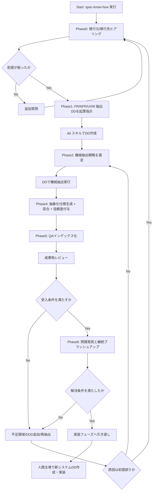

# spec-know-how + DD 連携フローチャート（v0.1）

## 1. 目的

`spec-know-how` と `dd` の使い分けを可視化し、作業者間の認識齟齬を防ぐ。

> 現場の実行順をそのまま追う人間向け手順は  
> `05_human-run-flowchart.md` を参照。

---

## 2. フロー図

---

## 3. ここまで進むとできること

## `I` 到達時（QAインデックス化完了）
- 仕様問い合わせに「回答 + 信頼度 + 根拠行」で返答可能
- FR/NFRの抽出漏れを一覧で確認可能
- 根拠薄い仕様をLow/Mediumとして分離管理可能

## `M` 到達時（実装引き渡し）
- 実装側は抽象化済み仕様を入力としてDDを開始できる
- 仕様の出典が明確なので、実装判断の再トレースが容易

---

## 4. つまずきやすいポイントと先回り注意

1. **ヒアリング不足のまま抽出開始**
   - 症状: 後で抽出方式が破綻し再作業になる
   - 対策: Phase0 完了をGate化する（未完了なら次へ進まない）

2. **FR偏重でNFRが抜ける**
   - 症状: 実装後にログ/セキュリティ/監査で手戻り
   - 対策: NFR専用DDを必須にする

3. **ワークフローに実装責務を持たせる**
   - 症状: オーケストレーションが肥大化し、再利用性が落ちる
   - 対策: 実行はDD側、ワークフローは指示と判定に限定

4. **機械抽出を固定化しすぎる**
   - 症状: 別技術スタックで適用不能
   - 対策: 抽出モジュール選択方式を採用

5. **QA回答が断定寄りになる**
   - 症状: 根拠不足でも断定して誤誘導
   - 対策: 信頼度Low/Mediumの出力ルールを強制する

6. **前提誤りなのに戦略調整だけで回し続ける**
   - 症状: 同じ失敗を繰り返すループ
   - 対策: 「原因が前提誤りか」を判定し、必要なら Phase0 に戻る

7. **問題を「見えているもの」だけで閉じる**
   - 症状: 後から重大課題が発覚する
   - 対策: Phase6で外部AIを含む問題発見ループを回し、解決条件達成まで継続する

---

## 5. 運用メモ（改善を育てるために）

- 各案件で「詰まった質問」「追加した抽出モジュール」「誤答事例」を残す
- 次版で、Phase0質問票と信頼度判定規約を更新する
- フロー図は運用実績に合わせて改版し続ける
