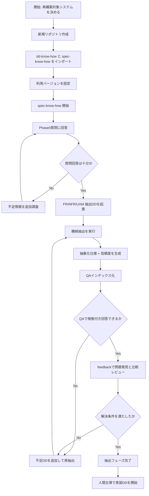

# spec-know-how 人間実行フローチャート（v0.1）

## 1. 目的

利用者が「この順で進めればよい」を迷わず実行できるように、実務手順に寄せたフローを定義する。

---

## 2. 想定シナリオ

例: `C:/repo/ua_develop-mr_staffapp-c8604db0151f` のような既存PHPアプリを再構築したい場合。

---

## 3. 人間向けクイックフロー（最短版）

1. 新規リポジトリを作成する  
2. `dd-know-how` と `spec-know-how` をインポートし、使用バージョン（タグ or SHA）を固定する  
3. `spec-know-how` ワークフローを開始し、質問に回答する  
4. ワークフロー完了後、`qa` で仕様確認できる状態を確認する  
5. `feedback` で問題発見 -> 外部AI比較 -> 改善条件の達成確認を行う  
6. 抽象化仕様を入力として、新システム実装DDを人間主導で開始する  

---

## 4. 人間向けフローチャート（詳細）

---

## 5. 各ステップの完了条件（実務用）

## Step 1-2 完了条件
- 新規リポジトリが作成済み
- 必要スキルが利用可能な状態
- スキルの利用バージョン（タグ or SHA）が記録済み

## Step 3 完了条件
- Phase0質問票への回答が記録済み
- 抽出対象と除外対象が明確

## Step 4 完了条件
- `qa` が「回答 + 信頼度 + 根拠行」を返せる

## Step 5 完了条件
- `export/feedback/` に問題発見・比較・改善ログが記録済み
- 改善課題の解決条件に対する判定結果がある

## Step 6 完了条件
- FR/NFR/UXM 抽象化仕様が実装入力として利用可能
- 未解消事項が一覧化されている

---

## 6. 先回り注意（現場で起きがちな問題）

1. **Phase0を短縮しすぎる**
   - 影響: 後半で抽出方式が合わず再作業
   - 対応: 不明点がある限り次フェーズへ進まない

2. **FRだけ進めてNFRを後回しにする**
   - 影響: 実装後にログ/セキュリティで大きな手戻り
   - 対応: NFR抽出DDを必須化

3. **QAを「答えだけ確認」に使う**
   - 影響: 根拠不明の誤答を見抜けない
   - 対応: 根拠行と信頼度を必ず確認

4. **抽出完了 = 実装完了と誤解する**
   - 影響: 実装計画と責務分離が崩れる
   - 対応: 抽出完了は「実装準備完了」と明記

5. **スキルバージョンを固定しない**
   - 影響: 案件途中で挙動が変わり再現できない
   - 対応: インポート時にタグ or SHA を記録する

6. **課題を列挙しただけで終了する**
   - 影響: ブラッシュアップが止まり、品質が上がらない
   - 対応: 各課題に解決条件を設定し、満たすまでループする
