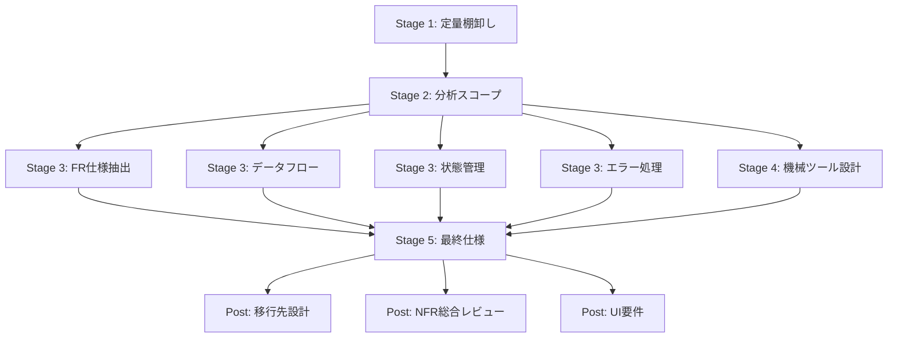

# DD-{番号}: 仕様抽出ポートフォリオインデックス

| 作成日 | 更新日 | ステータス | ステージ |
|--------|--------|------------|----------|
| {日付} | {日付} | 進行中 | 管理 |

## 目的

仕様抽出プロジェクト全体の DD 一覧・進捗・依存関係を一元管理する。

## 背景・課題

spec-know-how は起動時に全 DD を一括作成する。本 DD はその全体像を俯瞰し、
進捗追跡とスキップ判断の記録を集約するダッシュボードとして機能する。

## 対象システム情報

| 項目 | 値 |
|------|-----|
| コードベースパス | （起動時に記入） |
| 主要言語 | （Stage 1 で判明） |
| フレームワーク | （Stage 1 で判明） |
| DB | （Stage 1 で判明） |
| 総ファイル数 | （Stage 1 で判明） |
| 総 LOC | （Stage 1 で判明） |

## DD ポートフォリオ

| DD番号 | ステージ | タイトル | ステータス | スキップ | 依存先 |
|--------|----------|----------|------------|----------|--------|
| DD-{番号} | 管理 | ポートフォリオインデックス（本DD） | 進行中 | - | なし |
| DD-{番号} | Stage 1 | 定量棚卸し | 未着手 | - | なし |
| DD-{番号} | Stage 2 | 分析スコープ | 未着手 | - | Stage 1 |
| DD-{番号} | Stage 3 | FR 仕様抽出 | 未着手 | 未判定 | Stage 2 |
| DD-{番号} | Stage 3 | データフロー抽出 | 未着手 | 未判定 | Stage 2 |
| DD-{番号} | Stage 3 | 状態管理抽出 | 未着手 | 未判定 | Stage 2 |
| DD-{番号} | Stage 3 | エラー処理抽出 | 未着手 | 未判定 | Stage 2 |
| DD-{番号} | Stage 4 | 機械ツール設計 | 未着手 | 未判定 | Stage 2 |
| DD-{番号} | Stage 5 | 最終仕様 | 未着手 | 未判定 | Stage 3 + 4 |
| DD-{番号} | Post | 移行先設計 | 未着手 | 未判定 | Stage 5 |
| DD-{番号} | Post | NFR 総合レビュー | 未着手 | - | Stage 5 |
| DD-{番号} | Post | UI 要件 | 未着手 | 未判定 | Stage 5 |

## 依存関係図



## 決定事項

（実行中に判明したプロジェクト固有の決定をここに記録）

## タスク一覧

### Phase 0: 事前精査
- [ ] 📋 全 DD の作成確認（12 DD が揃っているか）
- [ ] 📋 対象システム情報の初期記入
- [ ] 😈 **Devil's Advocate調査**

### Phase 1: 進捗管理
- [ ] Stage 1 完了時にポートフォリオテーブルを更新
- [ ] Stage 2 完了時にスキップ判定結果を反映
- [ ] Stage 3〜5 完了時にステータスを更新
- [ ] Post DD 完了時に最終ステータスを更新
- [ ] 😈 **DA批判レビュー（「このPhaseで何が壊れるか」を最低1件発見）**

## タスク追加ガイドライン

実行中に新たなタスクが発見された場合、以下の手順に従って記録してください。

### タスク追加の手続き

1. **タスクを即座に追加する**
   ```markdown
   - [ ] 新しいタスク（{YYYY-MM-DD HH:MM} 発見）
   ```

2. **発見背景・理由を記録する**
   - なぜこのタスクが必要になったか
   - どの段階で発見されたか

3. **優先度を明記する**
   - `High`: ブロッキング（先に進めない）
   - `Medium`: 並列可能（他タスクと並行可）
   - `Low`: オプション（後で対応可）

4. **ログセクションに追加記録を残す**
   - 「何を発見したか」「なぜ追加したか」を簡潔に記述

### ログの記録例

```markdown
### {発見日時} タスク追加発見

**タスク**: [新規タスク名]
**背景**: [発見経緯]
**判断**: [なぜ追加が必要か]
**優先度**: High/Medium/Low
```

---

## ログ

### {日付}
- DD作成（spec-know-how 起動時に自動生成）

---

## DA批判レビュー記録

### Phase N DA批判レビュー

**DA観点:** （このPhaseで最も壊れやすいポイントは何か？）

| # | 発見した問題/改善点 | 重要度 | 再現手順（高/中は必須） | DA観点 | 対応 |
|---|-------------------|--------|----------------------|--------|------|
| 1 | (具体的に記述) | 高/中/低 | (高/中: 操作→結果) | (どのDA観点で発見したか) | ✅修正済/⏭️別DD/❌不要 |
